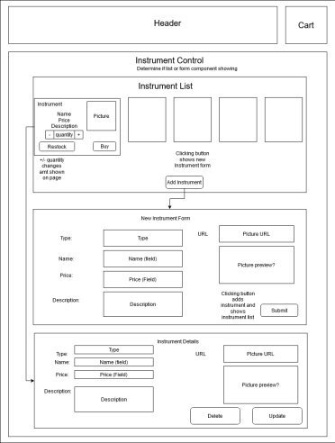

# _[Instrument Merchandiser](https://treblemakersmusic.netlify.app/)_

#### _React Application with full CRUD Functionality, 04.22.2020_

#### By _**Tiffany Siu, Krista Rutz, Andriy Veremyeyev**_

---

## Table of Contents

1. [Description](#description)
   - [Component Diagram](#component-diagram)
   - [Assignment Prompt](#assignment-prompt)
2. [Setup/Installation Requirements](#setup/installation-requirements)
   - [Requirements to Run](#requirements-to-run)
   - [Instructions](#instructions)
   - [Other Technologies Used](#other-technologies-used)
3. [Notable Features](#notable-features)
4. [Specifications](#specifications)
5. [Screenshots](#screenshots)
6. [Known Bugs](#known-bugs)
7. [Support and Contact Details](#support-and-contact-details)
8. [License](#license)

---

## Description

This application was created for an assignment for the Epicodus Intro to Programming and C#/React course. This was to practice adding CRUD functionality to a React application.

For our application, this site is selling musical instruments. It is for both the seller (with the ability to add, edit, and delete instruments from the list) and a buyer (with the ability to buy instruments). This site currently does not have the authentication to differentiate between the two types of users and all users currently have the ability to do all functions due to this assignment being focused on learning how to code the different functionalities.

**A deployed version of this application can be found [here](https://treblemakersmusic.netlify.app).**

### Component Diagram

### Assignment Prompt

Build a website for selling merchandise for a band, author, sports team, or any other purveyor that interests you.

A user should be able to do the following:

- [x] Create, Read, Update and Delete items in the store. Items should have fields for name, description, and quantity (along with any other fields you wish to add).
- [x] Increase or decrease the quantity of an item in the store. For instance, if a user clicks "Buy", the quantity will decrease by one. If a user clicks "Restock", it will increment by a specified number.
- [x] When the quantity of an item is reduced to 0, the item should say "Out of Stock". A user should not be able to reduce the quantity of an item below 0.

Further Exploration

- [ ] Create a Cart component. When a user clicks "Buy", the specified item should be added to the cart.
- [ ] A user should be able to view and remove items from the cart.
- [ ] Create a widget that shows the number of items in the cart. This widget should be updated when items are added to the cart.

## Setup/Installation Requirements

### Requirements to Run

- _Web Browser_
- _Webpack_
- _Node.js_
- _NPM_

### Instructions

_This page may be viewed by:_

1. Download and install Node.js from the [official website](https://nodejs.org/en/download/)
2. Clone the [repository](https://github.com/KristaRutz/instrument-merchandiser.git) from my [GitHub page](https://github.com/KristaRutz)
3. Use a command line/Bash to move to the project directory with `cd project-directory`
4. Run `npm install` to get all dependencies.
5. Run `npm run start` to start up the program

## Other Technologies Used

- _HTML_
- _CSS_
- _Javascript_
- _React_
- _ESLint_
- _Babel_
- _Markdown_

## Notable Features

<!-- _features that make project stand out_ -->

## Specifications

<!-- 

  
Click to expand to view Specifications

| Specification | Input | Output |
| :-------------     | :------------- | :------------- |
| The program displays welcome message and menu with prices | Application start | Welcome message and menu displayed |
| The program displays special deals in readable format | Application start | Special deals displayed ("Buy 2, get 1 free" "3 for $5") |
| The program takes input of user that is not an integer, then assume 0 ordered | Bread="aaa", Pastry="" | Bread=0, Pastry=0 |
| The program takes number of loaves of bread and pastries and displays totals | Bread=4, Pastry=4 | Bread=$20, Pastry=$8, Total=$28 |
| If input qualifies for special deals, costs calculated using discounted price | Bread=3, Pastry=3 | Bread=$10, Pastry=$5, Total=$15 |

 -->

## Screenshots

<!-- _Here is a snippet of what the input looks like:_

_Here is a preview of what the output looks like:_

 -->

<!-- 

  
Expand to view More Screenshots 

  

 -->

<!-- _{Show pictures using , show what library does as concisely as possible but don't need to explain how project solves problem from `code`_ -->

## Known Bugs

<!-- - The Add to Cart button has no functionality -->

_There are currently no known bugs in this program_

## Support and contact details

_If there are any question or concerns please contact us at our emails: [Tiffany](mailto:tsiu88@gmail.com), [Krista](mailto:rutzkri000@gmail.com), and [Andriy](mailto:belyybrat@gmail.com). Thank you._

### License

_This software is licensed under the MIT license_

Copyright (c) 2020 **_Tiffany Siu, Krista Rutz, Andriy Veremyeyev_**
